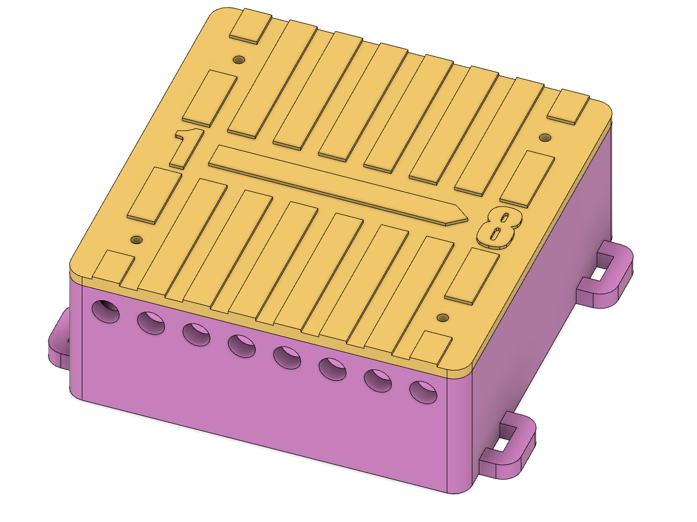
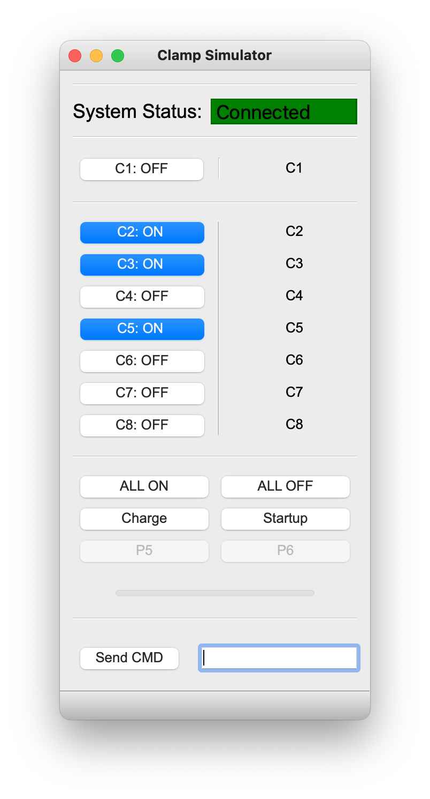
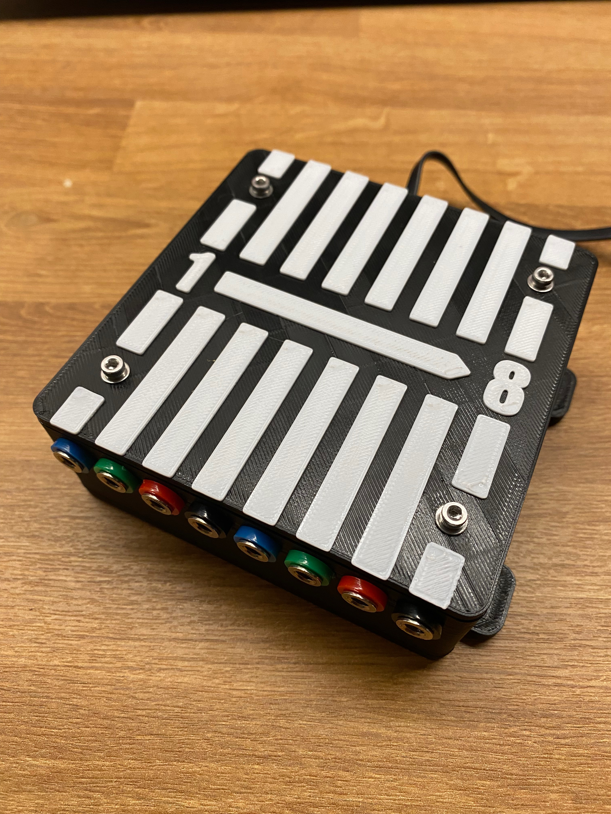

# GUI Based Application for ICSE014A Serial Relay Boards

Simply run the ClampControlMain.py

Serial Relay Board with 8 Channels: https://www.ebay.de/itm/272443356645
- Note: There are also 4 and 16 channel versions available

Sockets for the 3D printed case: https://www.amazon.de/dp/B07VWQQRHC?psc=1&ref=ppx_yo2ov_dt_b_product_details

## Project Images

    
    
    

